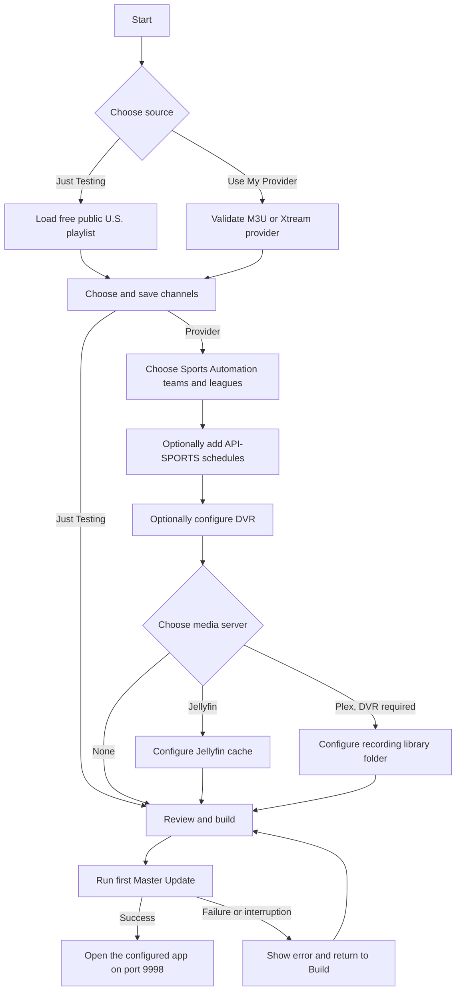

# Standalone Setup Wizard

This document describes the standalone setup wizard currently being tested on
port `9998`, plus the remaining work required before it replaces the normal
first-run experience on port `9999`.

## What works now

`docker-compose.setup.yml` starts an isolated copy of M3U Web Picker on port
`9998`. It has separate named volumes for application data, generated output,
DVR recordings, Jellyfin cache data, and backups. It does not mount the live
application's data and does not receive the Docker socket.

The current wizard configures the isolated application's real database and
settings. It is not a static mock-up.



The steps appear in this order:

1. **Start** — choose **Just Testing** or **Use My Provider**.
2. **Provider** — for a configured provider, validate a direct M3U URL or an
   Xtream base URL with both credentials.
3. **Channels** — search, filter, hide SD/Low Bandwidth channels, and save at
   least one channel to the isolated database.
4. **Sports** — optionally enable Sports Automation and choose one or more teams
   or leagues. This does not require API-SPORTS.
5. **Sports API** — optionally follow the API-SPORTS signup link and save an API
   key for canonical schedules.
6. **DVR** — optionally enable recording, choose its folder and concurrency,
   and configure commercial detection and immediate conversion.
7. **Media Server** — choose no media server, Jellyfin, or Plex. Plex recording
   export is available only when DVR is enabled. Choosing no media server keeps
   browser Library playback, Cast, and Roku support.
8. **Build** — review the choices and start the first Master Update.

**Just Testing** loads the iptv-org U.S. playlist, goes directly to channel
selection, and skips Sports, Sports API, DVR, and Media Server. Both source modes
use the normal guide and playback pipeline after setup.

## Build and redirect behaviour

The current **Build & Restart** action applies the choices to the isolated
runtime, writes preview installation files, and starts a Master Update. The
wizard remains on **Preparing your guide** until that update finishes. It then
switches the same container from the setup application to the configured normal
application and redirects the browser to `/` on port `9998`.

Despite the current button label, the isolated test does not restart Docker.
The future production installer will own the real container rebuild/restart.

If the update fails or the process is interrupted, setup remains incomplete and
offers another attempt from Build. Reloading the browser while the update is
running returns to the progress screen. **Start over** is rejected while the
first update is still running.

## Clean test commands

Run these commands from Windows PowerShell:

```powershell
Set-Location C:\m3u-web-picker
docker compose -f docker-compose.setup.yml down -v
docker compose -f docker-compose.setup.yml up -d --build setup
```

Open `http://localhost:9998` on the Docker host, or use that host's LAN address
from another device.

The `-v` option intentionally deletes only the named volumes belonging to the
isolated `m3u-picker-setup` project. Never add `-v` to a normal production
update command.

## Generated preview files

Build writes these files inside the isolated setup-output volume:

- `.env.preview`
- `compose.setup.generated.yml`
- `setup-manifest.json`

They describe the selected optional mounts and future handoff, but the isolated
test stack does not apply them to Docker. Provider credentials remain in the
isolated application database and are not written to these preview files.

## Host paths in the isolated test

The port-9998 stack deliberately uses Docker named volumes and does not bind the
Windows paths entered in the wizard. Those paths are validated and saved so the
flow can be tested, but they do not grant the test container access to arbitrary
host folders. Recording and cache activity on port `9998` stays in its isolated
named volumes.

## Production installer work still required

The standalone wizard is not yet the production installer. Before it can take
over fresh installations on port `9999`, a trusted host-side launcher must:

1. Check Docker, Docker Compose, LAN addressing, and optional NVIDIA support.
2. Start Setup on the final application address.
3. Validate and create only the host folders selected by the user.
4. Write the final `.env` and a generated Compose override with explicit bind
   mounts and any GPU reservation.
5. Back up existing configuration before replacing it.
6. Stop Setup, build/start the normal stack, verify its health, and let the
   waiting browser reload into the application.
7. Preserve existing installations during upgrades and provide a deliberate
   repair/reconfiguration path.

The launcher must not execute arbitrary browser-supplied commands. Setup must
not receive the Docker socket or an entire-drive mount.

The older downloadable flowchart files in this directory predate the current
wizard order and should be treated as historical design artefacts, not current
installation instructions.
