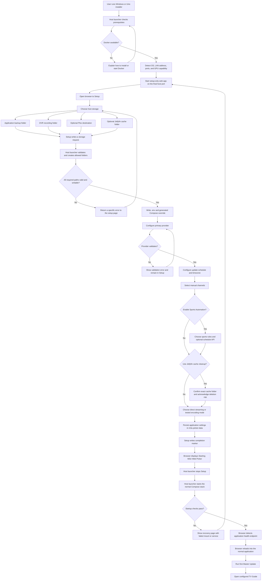

# Standalone Setup Wizard

This document describes a future first-run setup flow based on the current
Docker installation, onboarding wizard, DVR, Jellyfin cache integration, and
provider configuration. It is a design document only; the current runtime is
unchanged.

## Goal

Run setup before the normal application so every host folder and Docker bind
mount exists when the real container starts. The user should experience one
continuous browser wizard at the normal application address.

The setup application must not receive the Docker socket and must not mount an
entire host drive. A small host-side launcher owns Docker lifecycle operations,
folder creation, and host-path validation.

## Proposed first-run flow

[Download the large PNG](standalone-setup-wizard-flow-large.png) ·
[Download the scalable SVG](standalone-setup-wizard-flow.svg)

## Configuration ownership

The standalone setup stage should generate or populate the same configuration
the application uses today.

| Destination | Setup-owned values |
| --- | --- |
| `.env` | Host port, LAN host, backup directory, DVR directory, Jellyfin cache directory, encoder preference |
| Generated Compose override | GPU reservation and explicit host bind mounts |
| `m3u-picker-data` | Provider, update schedule, manual channels, sports rules, optional API settings, DVR settings, encoding settings |
| Setup completion marker | Schema version, completion state, and non-secret startup diagnostics |

Provider credentials remain in the persistent application database as they do
today. They should not be duplicated into `.env` or the generated Compose file.

## Host launcher responsibilities

The Windows PowerShell and Unix shell launchers should:

1. Detect Docker, Docker Compose, LAN addressing, and supported GPU runtime.
2. Start and monitor the setup-only application.
3. Validate requested host paths without granting that access to the container.
4. Create dedicated directories only after the user selects them.
5. Generate `.env` and a Compose override using explicit paths.
6. Stop Setup and start the normal application after completion.
7. Preserve existing configuration during upgrades and recovery runs.

The launcher should communicate with Setup through narrowly scoped files in a
dedicated setup-state directory. It should never execute arbitrary commands
received from the browser.

## Seamless browser handoff

Setup and the normal application use the same host and port, but never bind it
simultaneously. After the user finishes:

1. The setup page changes to a self-contained **Starting…** screen.
2. That page polls a stable health endpoint with exponential backoff.
3. The host launcher replaces the setup container with the normal container.
4. When the health response identifies the normal application, the page reloads.

This produces a short loading transition without exposing Docker controls to
the application or requiring the user to run another command.

## Existing behavior to preserve

- The free public provider remains available for first-run testing.
- Paid and free providers use the same downstream guide pipeline.
- DVR media never lives in the container layer.
- Plex output may remain inside the DVR mount initially; support for a separate
  Plex bind mount can be added without changing the handoff design.
- Jellyfin cache cleanup remains optional and requires explicit acknowledgement.
- Direct streaming remains the safe default when hardware encoding is not
  tested or available.
- Existing installations skip setup unless the user explicitly launches repair
  or reconfiguration mode.

## Recovery paths

Setup state should be resumable. A restart during setup returns to the last
completed step. If the normal application fails its startup checks, the launcher
returns to Setup with the exact failure instead of repeatedly restarting the
container. Existing `.env`, generated Compose, and database files should be
backed up before Setup replaces them.
